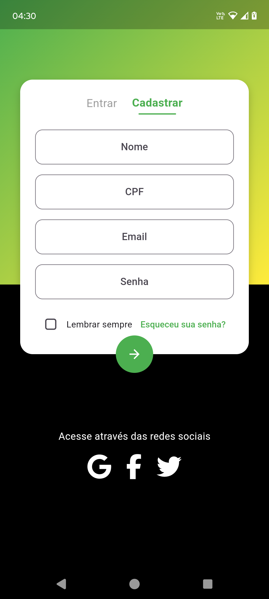

# Desafio Flutter

App Flutter com autenticação Firebase, cadastro de usuário, Firestore e gerenciamento via Cubit (Flutter Bloc).

---

## Funcionalidades

- Registro de usuário com email, senha, CPF e nome
- Login com CPF e senha
- Salvar dados do usuário no Firestore

---

## Tecnologias

- Flutter
- Firebase Authentication
- Cloud Firestore
- Flutter Bloc (Cubit)
- Flutter WebView
- Arquitetura MVVM

---

## Demonstração

### Tela de Login

### Tela de Cadastro de Usuário

### Drawer

### Menu Principal

